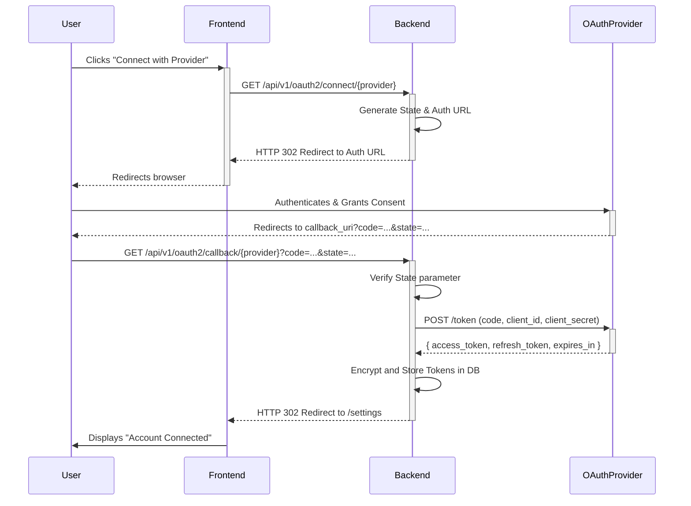

# OAuth2 Integration Architecture Design

**Author:** 架构师 (Architect Mode)
**Date:** 2025-06-08

This document outlines the architectural design for integrating OAuth2-based authentication into the existing email server application.

## 1. High-Level System Architecture

This diagram illustrates how the new OAuth2 authentication module coexists with the existing password-based authentication system.

```mermaid
graph TD
    subgraph User Facing
        A[Frontend App]
    end

    subgraph Backend Services
        B[API Gateway / Router]
        C[Existing Auth Service (Password-based)]
        D[New OAuth2 Service]
        E[User Service]
        F[Email Service (IMAP/SMTP)]
    end

    subgraph Databases
        G[User DB]
        H[New OAuth2 Token DB]
    end

    subgraph Third-Party
        I[OAuth2 Provider (e.g., Google)]
    end

    A -- REST API --> B

    B -- /login --> C
    B -- /oauth2/connect --> D
    B -- /oauth2/callback --> D
    B -- Authenticated Routes --> E
    B -- Authenticated Routes --> F

    C -- Verifies Credentials --> G
    D -- Stores/Retrieves Tokens --> H
    D -- Redirects User --> I
    I -- Redirects User with Code --> B

    E -- Accesses User Info --> G
    F -- Uses Stored Credentials/Tokens --> G
    F -- Uses Stored Credentials/Tokens --> H
```

**Description:**

*   The **Frontend App** initiates all authentication requests.
*   The **API Gateway** routes requests to the appropriate service based on the endpoint (`/login` vs. `/oauth2/...`).
*   The **Existing Auth Service** continues to handle traditional username/password logins.
*   The **New OAuth2 Service** manages the entire OAuth2 flow, from redirecting the user to the provider to handling the callback and storing tokens.
*   The **User Service** and **Email Service** are downstream services that rely on the authentication decision made by the upstream auth services.
*   A **New OAuth2 Token DB** is introduced to securely store access and refresh tokens, separate from the main User DB.

---

## 2. OAuth2 Authorization Code Flow Data Flow

This sequence diagram details the data flow for the OAuth2 Authorization Code grant type.



**Description:**

1.  The flow is initiated by the user on the frontend.
2.  The backend generates a state parameter for CSRF protection and the provider's authorization URL.
3.  The user authenticates with the provider and grants consent.
4.  The provider redirects the user back to the backend's callback endpoint with an authorization code.
5.  The backend validates the state and exchanges the code for tokens.
6.  The tokens are securely encrypted and stored in the database.
7.  The user is redirected back to the frontend, completing the flow.

---

## 3. Database Schema Design

To support OAuth2 integration, new tables are required to store provider configurations and user-specific tokens.

### `oauth_providers` Table

Stores configuration for each supported OAuth2 provider.

```sql
CREATE TABLE oauth_providers (
    id INT AUTO_INCREMENT PRIMARY KEY,
    name VARCHAR(50) NOT NULL UNIQUE,          -- e.g., 'google', 'microsoft'
    client_id VARCHAR(255) NOT NULL,
    client_secret_encrypted VARCHAR(512) NOT NULL, -- Encrypted client secret
    auth_url VARCHAR(255) NOT NULL,
    token_url VARCHAR(255) NOT NULL,
    scopes TEXT NOT NULL,                       -- Comma-separated list of scopes
    created_at TIMESTAMP DEFAULT CURRENT_TIMESTAMP,
    updated_at TIMESTAMP DEFAULT CURRENT_TIMESTAMP ON UPDATE CURRENT_TIMESTAMP
);
```

### `user_oauth_tokens` Table

Stores the access and refresh tokens for each user and connected account. This links a user in our system to their identity at the provider.

```sql
CREATE TABLE user_oauth_tokens (
    id INT AUTO_INCREMENT PRIMARY KEY,
    user_id INT NOT NULL,
    email_account_id INT NOT NULL,              -- Foreign key to the specific email account being connected
    provider_id INT NOT NULL,
    access_token_encrypted VARCHAR(2048) NOT NULL, -- Encrypted access token
    refresh_token_encrypted VARCHAR(2048),         -- Encrypted refresh token (can be null)
    token_type VARCHAR(50) DEFAULT 'Bearer',
    expiry DATETIME NOT NULL,                   -- Expiry date/time of the access token
    created_at TIMESTAMP DEFAULT CURRENT_TIMESTAMP,
    updated_at TIMESTAMP DEFAULT CURRENT_TIMESTAMP ON UPDATE CURRENT_TIMESTAMP,
    FOREIGN KEY (user_id) REFERENCES users(id) ON DELETE CASCADE,
    FOREIGN KEY (email_account_id) REFERENCES email_accounts(id) ON DELETE CASCADE,
    FOREIGN KEY (provider_id) REFERENCES oauth_providers(id) ON DELETE CASCADE
);
```

**Schema Rationale:**

*   **`oauth_providers`**: Centralizes provider configuration, making it easy to add or update providers without code changes. Client secrets are encrypted at rest.
*   **`user_oauth_tokens`**:
    *   Tightly couples tokens to both a `user_id` and an `email_account_id`, ensuring a clear ownership link.
    *   All sensitive token data is encrypted before being stored.
    *   The `expiry` field is crucial for the application to proactively refresh tokens before they expire, ensuring uninterrupted service.