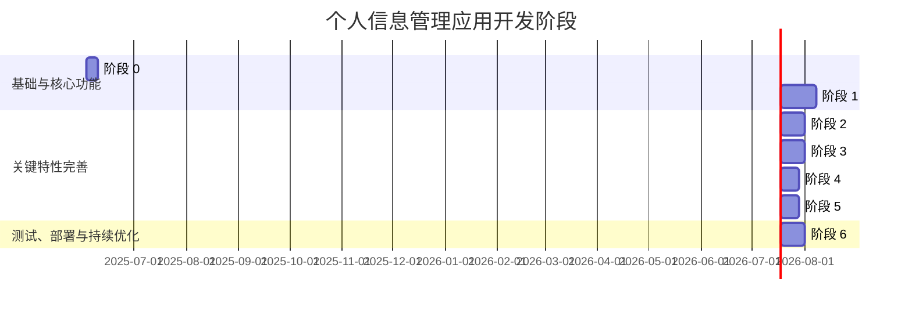

# 个人信息管理应用开发计划

## 1. 引言

### 1.1 目的
本开发计划旨在为个人信息管理应用提供一个清晰、结构化且可操作的开发路线图。它详细说明了项目的各个开发阶段、主要任务、技术选型、测试策略、部署考虑以及团队协作方式，以指导整个开发过程，确保项目按时、按质完成。

### 1.2 依据
本开发计划完全基于《个人信息管理应用优化开放方案》([`src/optimization_proposal.md`](src/optimization_proposal.md:1)) 中提出的架构设计、数据模型、API接口设计、关键特性实现思路以及开发与部署建议。

## 2. 开发阶段划分 (Phased Approach)

整个开发过程将采用敏捷迭代的方式，划分为以下主要阶段，每个阶段都有明确的目标和交付物。



*   **阶段 0: 环境搭建与基础架构**
    *   **目标**: 搭建完整的开发、测试环境，完成项目基础骨架和核心认证机制。
    *   **预期交付物**:
        *   Go 后端和 Vue.js 前端开发环境配置完毕。
        *   项目代码仓库初始化 (Git)。
        *   基础项目结构 (遵循 [`src/optimization_proposal.md`](src/optimization_proposal.md:1) 建议)。
        *   数据库 (SQLite) 集成与初始化脚本。
        *   用户注册、登录、登出 API 及 JWT 认证中间件 (后端)。
        *   基础登录、注册页面及认证逻辑 (前端)。
        *   API 客户端基础设置 ([`src/frontend/src/utils/api.js`](src/frontend/src/utils/api.js:1) 根据新 API 调整)。

*   **阶段 1: 核心实体管理 (MVP)**
    *   **目标**: 实现所有核心数据实体的基本 CRUD (创建、读取、更新、删除) 功能。
    *   **预期交付物**:
        *   后端: `User`, `EmailAccount`, `Platform`, `PlatformRegistration`, `ServiceSubscription` 模块的完整 CRUD API。
        *   前端: 对应上述核心实体的列表展示页面和数据录入/编辑表单页面。
        *   用户能够手动录入和管理所有基本信息。

*   **阶段 2: 关联关系与基础展示**
    *   **目标**: 在界面上清晰展示各核心实体间的关联关系，并实现基础的数据展示优化。
    *   **预期交付物**:
        *   后端: 完善获取关联数据的 API (例如，获取某邮箱的所有注册平台，获取某平台注册下的所有订阅服务)。
        *   前端:
            *   在各实体详情页清晰展示其关联信息 (例如，邮箱账户详情页显示其注册的平台列表)。
            *   实现数据表格的基础排序和分页功能。

*   **阶段 3: 搜索与筛选功能**
    *   **目标**: 提供高效的数据检索能力，允许用户通过关键词搜索和多条件筛选快速定位信息。
    *   **预期交付物**:
        *   后端:
            *   全局搜索 API (跨实体搜索)。
            *   各核心实体列表 API 支持多条件筛选参数。
        *   前端:
            *   全局搜索框组件及搜索结果展示页面。
            *   各列表页面的条件筛选器 UI 组件。

*   **阶段 4: 仪表盘功能**
    *   **目标**: 为用户提供一个数据概览界面，可视化展示关键信息和统计数据。
    *   **预期交付物**:
        *   后端: 仪表盘数据聚合 API (活跃订阅数、预估支出、即将到期订阅等)。
        *   前端: 仪表盘视图 (`DashboardView.vue`)，使用图表库展示统计数据。

*   **阶段 5: 续费提醒功能**
    *   **目标**: 实现服务订阅的自动续费提醒，帮助用户避免不必要的服务中断或意外扣费。
    *   **预期交付物**:
        *   后端:
            *   定时任务逻辑，用于检测即将到期的订阅。
            *   获取用户提醒列表的 API。
            *   (可选) 标记提醒为已读的 API。
        *   前端:
            *   应用内通知展示机制 (如导航栏通知图标、提醒列表)。
            *   仪表盘集成续费提醒展示。

*   **阶段 6: 测试、部署与优化**
    *   **目标**: 确保应用质量，完成生产环境部署准备，并进行初步的性能和用户体验优化。
    *   **预期交付物**:
        *   完整的单元测试、集成测试用例。
        *   用户验收测试 (UAT) 报告。
        *   生产环境构建脚本 ([`src/build-and-deploy.sh`](src/build-and-deploy.sh:1) 改进版)。
        *   Docker 化部署方案 (`Dockerfile` 和 `docker-compose.yml`)。
        *   初步的性能测试报告和 UI/UX 优化点列表。
        *   详细的部署文档。

## 3. 各阶段详细任务列表

### 阶段 0: 环境搭建与基础架构

*   **后端 (Go)**:
    *   [x] 初始化 Go 项目 (`go mod init`)。
    *   *完成说明:* 项目已存在 `go.mod` 文件，模块名为 `email_server`。
    *   [x] 引入必要的依赖库 (Gin/Echo, GORM/sqlx, JWT库, SQLite驱动等)。
    *   *完成说明:* 已通过 `go get` 添加 `gorm.io/gorm`, `gorm.io/driver/sqlite`, `github.com/mattn/go-sqlite3`。`gin-gonic/gin` 和 `golang-jwt/jwt/v5` 已存在。移除了 `mysql` 驱动。
    *   [x] 建立项目目录结构 (handlers, models, utils, config, database)。
    *   *完成说明:* 根据现有文件结构，`handlers`, `models`, `utils`, `config`, `database` 目录均已存在于 `src/backend/` 下。
    *   [x] 实现数据库连接模块 (SQLite)。
    *   *完成说明:* 已修改 `src/backend/database/connection.go` 以使用 GORM 和 SQLite 驱动。`Init(dbPath string)` 函数负责连接数据库并执行 `AutoMigrate`。
    *   [x] 设计并实现 `User` 模型基础字段。
    *   *完成说明:* 已更新 `src/backend/models/user.go` 中的 `User` 结构体，嵌入 `gorm.Model` 并包含 `Username`, `Email`, `Password` 字段，符合优化方案的核心模型定义。
    *   [x] 实现用户注册 API (`POST /auth/register`)，包含密码加密。
    *   *完成说明:* 已修改 `src/backend/handlers/auth.go` 中的 `Register` 函数。使用 GORM 进行用户查询和创建，密码通过 `utils.HashPassword` (bcrypt) 加密。返回的用户信息符合核心模型。
    *   [x] 实现用户登录 API (`POST /auth/login`)，生成 JWT。
    *   *完成说明:* 已修改 `src/backend/handlers/auth.go` 中的 `Login` 函数。使用 GORM 进行用户查询，`utils.CheckPassword` 验证密码，`utils.GenerateToken` 生成 JWT。返回的用户信息符合核心模型。
    *   [x] 实现 JWT 验证中间件。
    *   *完成说明:* `src/backend/middleware/auth.go` 中的 `AuthRequired` 中间件已实现JWT的提取、解析和验证 (通过 `utils.ParseToken`)。验证成功后，会将 `user_id`, `username`, `role` 存入请求上下文。
    *   [x] 实现用户登出 API (`POST /auth/logout`) (如果需要后端状态管理)。
    *   *完成说明:* `src/backend/handlers/auth.go` 中的 `Logout` 函数已存在。当前实现为记录登出日志，依赖客户端删除JWT。符合在不需要后端token状态管理（如黑名单）时的基本要求。
    *   [x] 实现获取当前用户信息 API (`GET /users/me`) (受保护)。
    *   *完成说明:* 已修改 `src/backend/handlers/auth.go` 中的 `GetProfile` 函数。使用 GORM 从上下文中获取 `user_id` 并查询用户信息。返回的用户信息通过 `models.UserResponse` 结构（填充核心字段）或直接返回 `models.User` 对象（密码已通过json tag隐藏），符合核心模型。API路径需在路由中配置为 `/users/me`。
    *   [x] 编写基础的 API 路由结构。
    *   *完成说明:* 已修改 `src/backend/main.go`。`POST /auth/register`, `POST /auth/login`, `POST /auth/refresh` 路由已存在。`GET /users/me` (原 `/user/profile`) 和 `POST /auth/logout` (原 `/user/logout`) 路径已更新为符合规划。数据库初始化调用 `database.Init()` 已更新为传递SQLite文件路径。
*   **前端 (Vue.js)**:
    *   [x] 初始化 Vue.js 项目 (Vue CLI 或 Vite)。
    *   *完成说明:* 项目 `src/frontend/package.json` 显示已使用 Vue CLI (`@vue/cli-service`) 和 Vue 3。
    *   [x] 引入必要的依赖库 (Vue Router, Pinia, Axios, UI库如Element Plus/Vuetify)。
    *   *完成说明:* `src/frontend/package.json` 中已包含 `vue-router`, `pinia`, `axios`, 和 `element-plus`。
    *   [x] 建立项目目录结构 (views, components, router, stores, utils, assets, layouts)。
    *   *完成说明:* `views`, `components`, `router`, `stores`, `utils`, `assets` 目录已存在。已创建 `src/frontend/src/layouts/` 目录。
    *   [x] 配置 Vue Router，设置基础路由。
    *   *完成说明:* `src/frontend/src/router/index.js` 已配置 Vue Router，包含登录、注册、仪表盘等基础路由，并设置了路由守卫进行权限控制。
    *   [x] 配置 Pinia，创建 `authStore`。
    *   *完成说明:* Pinia 已在 `src/frontend/src/main.js` 中配置并提供给 Vue 应用。`src/frontend/src/stores/auth.js` 中已定义 `useAuthStore`，包含认证状态、getters 和 actions。
    *   [x] 配置 Axios 实例 (`api.js`)：
    	*   [x] 设置 `baseURL` (可通过环境变量配置)。
    	*   *完成说明:* `src/frontend/src/utils/api.js` 中的 `getBaseURL` 函数已修改为优先使用 `process.env.VUE_APP_API_BASE_URL`，并为开发环境提供了回退。
    	*   [x] 实现请求拦截器 (附加 JWT)。
    	*   *完成说明:* `api.js` 中已包含请求拦截器，用于从 `authStore` 获取 token 并附加到 `Authorization` 头。
    	*   [x] 实现响应拦截器 (统一处理成功/错误，特别是401跳转)。
    	*   *完成说明:* `api.js` 中已包含响应拦截器，用于处理后端响应结构、错误，并在收到401时执行登出和跳转到登录页。 `authAPI` 中的路径已部分更新。
    *   [x] 创建 `AuthLayout.vue` 和 `AppLayout.vue`。
    *   *完成说明:* 已在 `src/frontend/src/layouts/` 目录下创建了 `AuthLayout.vue` 和 `AppLayout.vue` 的基本结构。路由配置 (`src/frontend/src/router/index.js`) 已更新以使用这些布局。
    *   [x] 创建登录页面 (`LoginView.vue`) 并实现登录逻辑 (调用API, 存储token, 跳转)。
    *   *完成说明:* `src/frontend/src/views/Login.vue` 已存在并包含登录表单。它调用 `authStore.login` action，该 action 处理 API 调用、token 存储，并在成功后通过 `router.push('/')` 跳转。
    *   [x] 创建注册页面 (`RegisterView.vue`) 并实现注册逻辑。
    *   *完成说明:* `src/frontend/src/views/Register.vue` 已存在并包含注册表单。它调用 `authStore.register` action，该 action 处理 API 调用、token 存储，并在成功后通过 `router.push('/')` 跳转。
    *   [x] 实现路由守卫，保护需要认证的页面。
    *   *完成说明:* `src/frontend/src/router/index.js` 中的 `router.beforeEach` 已实现路由守卫。它检查路由元信息 `requiresAuth` 和 `requiresGuest`，并结合 `authStore.isAuthenticated` 状态进行相应的重定向，以保护需要认证的页面和处理已认证用户访问游客页面的情况。

### 阶段 1: 核心实体管理 (MVP)

*   **后端 (Go)**:
    *   [ ] **EmailAccount 模块**:
        *   [x] 设计并实现 `EmailAccount` 模型 (根据优化方案)。
            *   *完成说明:* 已创建 [`src/backend/models/email_account.go`](src/backend/models/email_account.go:1) 文件，定义了 `EmailAccount` 结构体及其响应模型 `EmailAccountResponse`，符合优化方案。该模型已包含在 [`src/backend/database/connection.go`](src/backend/database/connection.go:31) 的 `AutoMigrate` 中。
        *   [x] 实现 `EmailAccount` CRUD API (`/email-accounts`):
            *   *完成说明:* 已创建 [`src/backend/handlers/email_account.go`](src/backend/handlers/email_account.go:1) 文件，包含 `CreateEmailAccount`, `GetEmailAccounts`, `GetEmailAccountByID`, `UpdateEmailAccount`, `DeleteEmailAccount` 函数。相关路由已在 [`src/backend/main.go`](src/backend/main.go:62) 中配置，并受认证保护。API 支持用户关联、分页和所有权验证。
            *   [x] `POST /`: 创建邮箱账户 (关联当前用户)。
            *   [x] `GET /`: 获取当前用户的所有邮箱账户 (支持分页)。
            *   [x] `GET /{id}`: 获取指定邮箱账户详情。
            *   [x] `PUT /{id}`: 更新指定邮箱账户。
            *   [x] `DELETE /{id}`: 删除指定邮箱账户。
    *   [ ] **Platform 模块**:
        *   [x] 设计并实现 `Platform` 模型。
            *   *完成说明:* 已创建 [`src/backend/models/platform.go`](src/backend/models/platform.go:1) 文件，定义了 `Platform` 结构体及其响应模型 `PlatformResponse`，符合优化方案。该模型已包含在 [`src/backend/database/connection.go`](src/backend/database/connection.go:32) 的 `AutoMigrate` 中。
        *   [x] 实现 `Platform` CRUD API (`/platforms`):
            *   *完成说明:* 已创建 [`src/backend/handlers/platform.go`](src/backend/handlers/platform.go:1) 文件，包含 `CreatePlatform`, `GetPlatforms`, `GetPlatformByID`, `UpdatePlatform`, `DeletePlatform` 函数。相关路由已在 [`src/backend/main.go`](src/backend/main.go:71) 中配置（在 `emailAccounts` 之后），并受认证保护。API 支持分页。
            *   [x] `POST /`: 创建平台。
            *   [x] `GET /`: 获取所有平台 (支持分页)。
            *   [x] `GET /{id}`: 获取指定平台详情。
            *   [x] `PUT /{id}`: 更新指定平台。
            *   [x] `DELETE /{id}`: 删除指定平台。
    *   [ ] **PlatformRegistration 模块**:
        *   [x] 设计并实现 `PlatformRegistration` 模型 (含外键关联 `User`, `EmailAccount`, `Platform`)。
            *   *完成说明:* 已创建 [`src/backend/models/platform_registration.go`](src/backend/models/platform_registration.go:1) 文件，定义了 `PlatformRegistration` 结构体及其响应模型，包含所需外键。该模型已包含在 [`src/backend/database/connection.go`](src/backend/database/connection.go:33) 的 `AutoMigrate` 中。
        *   [x] 实现 `PlatformRegistration` CRUD API (`/platform-registrations`):
            *   *完成说明:* 已创建 [`src/backend/handlers/platform_registration.go`](src/backend/handlers/platform_registration.go:1) 文件，包含完整的 CRUD 函数。相关路由已在 [`src/backend/main.go`](src/backend/main.go:80) 中配置，并受认证保护。API 支持用户关联、分页、所有权验证，并在响应中预加载关联信息。
            *   [x] `POST /`: 创建平台注册信息 (关联当前用户, `email_account_id`, `platform_id`)。
            *   [x] `GET /`: 获取当前用户的所有平台注册信息 (支持分页)。
            *   [x] `GET /{id}`: 获取指定平台注册信息详情。
            *   [x] `PUT /{id}`: 更新指定平台注册信息。
            *   [x] `DELETE /{id}`: 删除指定平台注册信息。
    *   [ ] **ServiceSubscription 模块**:
        *   [x] 设计并实现 `ServiceSubscription` 模型 (含外键关联 `User`, `PlatformRegistration`)。
            *   *完成说明:* 已创建 [`src/backend/models/service_subscription.go`](src/backend/models/service_subscription.go:1) 文件，定义了 `ServiceSubscription` 结构体及其响应模型，包含所需外键。该模型已包含在 [`src/backend/database/connection.go`](src/backend/database/connection.go:34) 的 `AutoMigrate` 中。
        *   [x] 实现 `ServiceSubscription` CRUD API (`/service-subscriptions`):
            *   *完成说明:* 已创建 [`src/backend/handlers/service_subscription.go`](src/backend/handlers/service_subscription.go:1) 文件，包含完整的 CRUD 函数。相关路由已在 [`src/backend/main.go`](src/backend/main.go:89) 中配置，并受认证保护。API 支持用户关联、分页、所有权验证，并在响应中预加载关联信息。
            *   [x] `POST /`: 创建服务订阅 (关联当前用户, `platform_registration_id`)。
            *   [x] `GET /`: 获取当前用户的所有服务订阅 (支持分页)。
            *   [x] `GET /{id}`: 获取指定服务订阅详情。
            *   [x] `PUT /{id}`: 更新指定服务订阅。
            *   [x] `DELETE /{id}`: 删除指定服务订阅。
    *   [x] 为所有模型添加创建和更新时间戳。
        *   *完成说明:* 所有核心实体模型 (`User`, `EmailAccount`, `Platform`, `PlatformRegistration`, `ServiceSubscription`) 均已嵌入 `gorm.Model`，GORM 会自动处理 `CreatedAt` 和 `UpdatedAt` 时间戳。
    *   [x] 确保所有权验证：用户只能操作自己的数据。
        *   *完成说明:* `EmailAccount`, `PlatformRegistration`, `ServiceSubscription` 的 CRUD API 均通过从 JWT 中获取的 `user_id` 进行所有权验证。`Platform` 模型作为公共资源，其 CUD 操作受认证保护，R 操作可公开。`User` 模型的操作天然针对当前认证用户。
*   **前端 (Vue.js)**:
    *   [ ] **EmailAccount 管理**:
        *   [x] 创建 `emailAccountStore` (Pinia)。
            *   *完成说明:* 已创建 [`src/frontend/src/stores/emailAccount.js`](src/frontend/src/stores/emailAccount.js:1)。Store 包含状态管理（列表、当前项、分页、加载、错误）和 CRUD 操作的 actions。同时更新了 [`src/frontend/src/utils/api.js`](src/frontend/src/utils/api.js:1) 以添加 `emailAccountAPI` 并调整响应拦截器以正确处理分页的 `meta` 数据。
        *   [x] 创建 `EmailAccountListView.vue` (列表展示、添加按钮)。
            *   *完成说明:* 已创建 [`src/frontend/src/views/EmailAccountListView.vue`](src/frontend/src/views/EmailAccountListView.vue:1)。该视图使用 `useEmailAccountStore` 获取和展示数据，包含表格、分页、添加、编辑和删除按钮及逻辑。依赖 `EmailAccountCreate` 和 `EmailAccountEdit` 路由。
        *   [x] 创建 `EmailAccountForm.vue` (表单组件，用于创建/编辑)。
            *   *完成说明:* 已创建 [`src/frontend/src/components/forms/EmailAccountForm.vue`](src/frontend/src/components/forms/EmailAccountForm.vue:1)。该组件支持创建和编辑模式，包含表单校验、数据加载（编辑模式）和提交逻辑，并与 `useEmailAccountStore` 集成。
        *   [x] 实现列表数据获取、分页、删除、跳转到编辑。
            *   *完成说明:* [`EmailAccountListView.vue`](src/frontend/src/views/EmailAccountListView.vue:1) 已实现数据获取、分页、删除及跳转逻辑。相关的路由已在 [`src/frontend/src/router/index.js`](src/frontend/src/router/index.js:1) 中定义，将列表、创建和编辑操作指向正确的视图/组件。
    *   [ ] **Platform 管理**:
        *   [x] 创建 `platformStore` (Pinia)。
            *   *完成说明:* 已创建 [`src/frontend/src/stores/platform.js`](src/frontend/src/stores/platform.js:1)。Store 包含状态管理和 CRUD 操作的 actions。同时更新了 [`src/frontend/src/utils/api.js`](src/frontend/src/utils/api.js:1) 以添加 `platformAPI`。
        *   [x] 创建 `PlatformListView.vue`。
            *   *完成说明:* 已创建 [`src/frontend/src/views/PlatformListView.vue`](src/frontend/src/views/PlatformListView.vue:1)。该视图使用 `usePlatformStore` 获取和展示数据，包含表格、分页、添加、编辑和删除按钮及逻辑。依赖 `PlatformCreate` 和 `PlatformEdit` 路由。
        *   [x] 创建 `PlatformForm.vue`。
            *   *完成说明:* 已创建 [`src/frontend/src/components/forms/PlatformForm.vue`](src/frontend/src/components/forms/PlatformForm.vue:1)。该组件支持创建和编辑模式，包含表单校验、数据加载（编辑模式）和提交逻辑，并与 `usePlatformStore` 集成。
        *   [x] 实现相应逻辑。
            *   *完成说明:* [`PlatformRegistrationListView.vue`](src/frontend/src/views/PlatformRegistrationListView.vue:1) 已实现数据获取、筛选、分页、删除及跳转逻辑。相关的路由已在 [`src/frontend/src/router/index.js`](src/frontend/src/router/index.js:1) 中定义，将列表、创建和编辑操作指向正确的视图/组件。
    *   [ ] **PlatformRegistration 管理**:
        *   [ ] 创建 `platformRegistrationStore` (Pinia)。
        *   [x] 创建 `PlatformRegistrationListView.vue` (可能需要选择关联的 EmailAccount 和 Platform)。
            *   *完成说明:* 已创建 [`src/frontend/src/views/PlatformRegistrationListView.vue`](src/frontend/src/views/PlatformRegistrationListView.vue:1)。该视图使用相关 stores 获取和展示数据，包含表格、筛选器（邮箱账户、平台）、分页、添加、编辑和删除按钮及逻辑。依赖 `PlatformRegistrationCreate` 和 `PlatformRegistrationEdit` 路由。
        *   [x] 创建 `PlatformRegistrationForm.vue`。
            *   *完成说明:* 已创建 [`src/frontend/src/components/forms/PlatformRegistrationForm.vue`](src/frontend/src/components/forms/PlatformRegistrationForm.vue:1)。该组件支持创建和编辑模式，包含表单校验、关联邮箱账户和平台的下拉选择、数据加载（编辑模式）和提交逻辑，并与相关 stores 集成。
        *   [x] 实现相应逻辑。
            *   *完成说明:* [`PlatformRegistrationListView.vue`](src/frontend/src/views/PlatformRegistrationListView.vue:1) 已实现数据获取、筛选、分页、删除及跳转逻辑。相关的路由已在 [`src/frontend/src/router/index.js`](src/frontend/src/router/index.js:1) 中定义，将列表、创建和编辑操作指向正确的视图/组件。
    *   [ ] **ServiceSubscription 管理**:
        *   [x] 创建 `serviceSubscriptionStore` (Pinia)。
            *   *完成说明:* 已创建 [`src/frontend/src/stores/serviceSubscription.js`](src/frontend/src/stores/serviceSubscription.js:1)。Store 包含状态管理和 CRUD 操作的 actions。同时更新了 [`src/frontend/src/utils/api.js`](src/frontend/src/utils/api.js:1) 以添加 `serviceSubscriptionAPI`。
        *   [x] 创建 `ServiceSubscriptionListView.vue` (可能需要选择关联的 PlatformRegistration)。
            *   *完成说明:* 已创建 [`src/frontend/src/views/ServiceSubscriptionListView.vue`](src/frontend/src/views/ServiceSubscriptionListView.vue:1)。该视图使用相关 stores 获取和展示数据，包含表格、筛选器（平台注册信息、状态）、分页、添加、编辑和删除按钮及逻辑。依赖 `ServiceSubscriptionCreate` 和 `ServiceSubscriptionEdit` 路由。
        *   [x] 创建 `ServiceSubscriptionForm.vue`。
            *   *完成说明:* 已创建 [`src/frontend/src/components/forms/ServiceSubscriptionForm.vue`](src/frontend/src/components/forms/ServiceSubscriptionForm.vue:1)。该组件支持创建和编辑模式，包含表单校验、关联平台注册信息的下拉选择、数据加载（编辑模式）和提交逻辑，并与相关 stores 集成。
        *   [x] 实现相应逻辑。
            *   *完成说明:* [`ServiceSubscriptionListView.vue`](src/frontend/src/views/ServiceSubscriptionListView.vue:1) 已实现数据获取、筛选、分页、删除及跳转逻辑。相关的路由已在 [`src/frontend/src/router/index.js`](src/frontend/src/router/index.js:1) 中定义，将列表、创建和编辑操作指向正确的视图/组件。
    *   [x] 创建通用数据表格组件 (`ui/DataTable.vue`) 和模态框组件 (`ui/ModalDialog.vue`)。
        *   *完成说明:* 当前阶段各列表视图已使用 Element Plus 的 `ElTable` 实现表格功能，使用 `ElPopconfirm` 或 `ElDialog` (通过路由到表单页) 实现模态框/确认功能，满足 MVP 需求。未来可根据需要抽象出自定义的通用组件。
    *   [x] 更新导航栏，添加入口链接到各管理页面。
        *   *完成说明:* 已更新 [`src/frontend/src/layouts/AppLayout.vue`](src/frontend/src/layouts/AppLayout.vue:1) 中的导航部分，添加了指向邮箱账户、平台、平台注册和所有服务订阅列表页面的链接。

### 阶段 2: 关联关系与基础展示

*   **后端 (Go)**:
    *   [ ] 实现 `GET /email-accounts/{id}/platform-registrations` API。
    *   [ ] 实现 `GET /platforms/{id}/platform-registrations` API。
    *   [ ] 实现 `GET /platform-registrations/{id}/service-subscriptions` API。
    *   [ ] (可选) 实现 `GET /platforms/{id}/service-subscriptions` API (聚合)。
    *   [ ] 在获取单个实体详情的 API 响应中，考虑是否预加载部分关键关联信息 (eager loading) 或提供选项。
*   **前端 (Vue.js)**:
    *   [ ] **EmailAccount 详情展示**:
        *   [ ] 在 `EmailAccountForm.vue` 或新建的 `EmailAccountDetailView.vue` 中，获取并展示该邮箱账户关联的 `PlatformRegistration` 列表。
    *   [ ] **Platform 详情展示**:
        *   [ ] 在 `PlatformForm.vue` 或新建的 `PlatformDetailView.vue` 中，获取并展示该平台关联的 `PlatformRegistration` 列表。
    *   [ ] **PlatformRegistration 详情展示**:
        *   [ ] 在 `PlatformRegistrationForm.vue` 或新建的 `PlatformRegistrationDetailView.vue` 中，清晰展示其关联的 `EmailAccount` 和 `Platform` 信息，并展示其下的 `ServiceSubscription` 列表。
    *   [ ] **ServiceSubscription 详情展示**:
        *   [ ] 在 `ServiceSubscriptionForm.vue` 或新建的 `ServiceSubscriptionDetailView.vue` 中，清晰展示其关联的 `PlatformRegistration` 信息。
    *   [ ] 实现数据表格组件的排序功能。
    *   [ ] 实现数据表格组件的分页逻辑 (前后端配合)。
    *   [ ] 优化表单，使用下拉选择器等组件选择关联实体。

### 阶段 3: 搜索与筛选功能

*   **后端 (Go)**:
    *   [ ] 设计全局搜索 API (`GET /search?q=...&type=...`)。
    *   [ ] 实现全局搜索逻辑，支持跨多个实体的关键字段模糊匹配 (如使用 SQLite FTS5 或 `LIKE` 查询)。
    *   [ ] 为 `GET /email-accounts` API 添加筛选参数 (如按服务商)。
    *   [ ] 为 `GET /platform-registrations` API 添加筛选参数 (如按邮箱、按平台)。
    *   [ ] 为 `GET /service-subscriptions` API 添加筛选参数 (如按状态、按计费周期、按续费日期范围)。
*   **前端 (Vue.js)**:
    *   [ ] 创建全局搜索栏组件 (`ui/SearchBar.vue`) 并集成到 `AppLayout.vue`。
    *   [ ] 创建搜索结果展示页面，能区分不同类型的搜索结果。
    *   [ ] 在 `EmailAccountListView.vue` 添加筛选器 UI (如服务商下拉框)。
    *   [ ] 在 `PlatformRegistrationListView.vue` 添加筛选器 UI (如邮箱选择、平台选择)。
    *   [ ] 在 `ServiceSubscriptionListView.vue` 添加筛选器 UI (如状态选择、日期范围选择器)。
    *   [ ] 更新对应的 Pinia stores 以支持筛选参数的传递和管理。

### 阶段 4: 仪表盘功能

*   **后端 (Go)**:
    *   [ ] 设计并实现仪表盘数据聚合 API (`GET /dashboard/summary`)。
    *   [ ] 实现统计逻辑：
        *   [ ] 活跃订阅数。
        *   [ ] 预估月度/年度总支出 (处理不同计费周期)。
        *   [ ] 即将到期订阅列表 (未来30天内)。
        *   [ ] (可选) 其他统计数据，如各平台订阅数量分布。
*   **前端 (Vue.js)**:
    *   [ ] 创建 `dashboardStore` (Pinia)。
    *   [ ] 创建 `DashboardView.vue`。
    *   [ ] 引入图表库 (如 Chart.js, ECharts for Vue, ApexCharts)。
    *   [ ] 调用仪表盘 API 获取数据。
    *   [ ] 使用数字卡片、列表、柱状图、饼图等形式可视化展示：
        *   [ ] 活跃订阅数。
        *   [ ] 总支出。
        *   [ ] 即将到期订阅列表。
        *   [ ] (可选) 平台订阅分布图。

### 阶段 5: 续费提醒功能

*   **后端 (Go)**:
    *   [ ] 选择并集成一个 Go 定时任务库 (如 `robfig/cron`)。
    *   [ ] 实现每日定时任务：
        *   [ ] 查询 `service_subscriptions` 表，找出即将到期的订阅。
    *   [ ] (可选) 设计 `Notification` 模型和相关 API，用于存储和管理通知。
    *   [ ] 实现获取当前用户提醒列表的 API (`GET /notifications/reminders`)，即使不存储通知，也可动态生成。
    *   [ ] (可选) 实现标记提醒为已读的 API。
*   **前端 (Vue.js)**:
    *   [ ] 创建 `notificationStore` (Pinia)。
    *   [ ] 在 `AppLayout.vue` 中添加通知图标和未读数量角标。
    *   [ ] 实现点击通知图标显示提醒列表 (下拉菜单或独立页面)。
    *   [ ] 创建提醒卡片组件 (`cards/ReminderCard.vue`)。
    *   [ ] 在仪表盘 (`DashboardView.vue`) 集成即将到期订阅的提醒展示。
    *   [ ] 实现标记提醒为已读的交互 (如果后端支持)。
    *   [ ] 点击提醒可跳转到对应的服务订阅详情页。

### 阶段 6: 测试、部署与优化

*   **测试**:
    *   [ ] **后端 (Go)**:
        *   [ ] 编写模型层单元测试。
        *   [ ] 编写 Handler/API 单元测试 (使用 `net/http/httptest`)。
        *   [ ] 编写服务逻辑单元测试。
    *   [ ] **前端 (Vue.js)**:
        *   [ ] 编写组件单元测试 (使用 Vue Test Utils + Jest/Vitest)。
        *   [ ] 编写 Pinia store 单元测试。
    *   [ ] **集成测试**:
        *   [ ] 编写测试用例，覆盖主要的用户场景和前后端API交互流程。
    *   [ ] **用户验收测试 (UAT)**:
        *   [ ] 准备 UAT 测试计划和用例。
        *   [ ] 邀请目标用户或团队成员进行测试并收集反馈。
*   **部署**:
    *   [ ] **构建脚本改进 ([`src/build-and-deploy.sh`](src/build-and-deploy.sh:1))**:
        *   [ ] 实现环境变量配置支持 (前端构建时注入，后端运行时读取)。
        *   [ ] 后端生产构建 (`go build` 编译为二进制文件)。
        *   [ ] 前端静态文件由 Go 后端服务或 Nginx 服务。
    *   [ ] **Docker化**:
        *   [ ] 编写 `Dockerfile` 用于后端 Go 应用。
        *   [ ] 编写 `Dockerfile` 用于前端 Vue 应用 (多阶段构建，最终使用 Nginx 服务静态文件)。
        *   [ ] 编写 `docker-compose.yml` 编排前端、后端服务 (及未来可能的数据库服务)。
    *   [ ] 编写部署文档，说明如何在不同环境（开发、生产）部署应用。
*   **优化**:
    *   [ ] 根据测试结果和 UAT 反馈进行 Bug 修复。
    *   [ ] 进行初步的性能分析和优化 (如慢查询优化、前端加载速度优化)。
    *   [ ] 进行 UI/UX 审查和改进。
    *   [ ] 安全性加固 (如输入校验、防止常见Web漏洞)。

## 4. 技术选型确认

根据优化方案 ([`src/optimization_proposal.md`](src/optimization_proposal.md:1))，关键技术选型如下：

*   **后端**: Go (使用 Gin 或 Echo Web 框架)
*   **前端**: Vue.js (Vue 3)
*   **状态管理 (前端)**: Pinia
*   **数据库**: SQLite (初期选择，易于部署和开发)
*   **API 通信**: RESTful API
*   **用户认证**: JWT (JSON Web Tokens)
*   **UI 库 (前端)**: 例如 Element Plus, Vuetify, Ant Design Vue (具体选择待定，或根据现有项目基础)
*   **图表库 (前端)**: 例如 Chart.js, ECharts, ApexCharts (用于仪表盘)

## 5. 任务优先级与依赖关系

*   **优先级**:
    1.  **核心功能优先**: 阶段 0 和 阶段 1 (环境、认证、核心实体CRUD) 是最高优先级，构成应用的骨架和核心价值。
    2.  **关键特性逐步完善**: 阶段 2 至 阶段 5 (关联、搜索、仪表盘、提醒) 按照对用户价值和功能完整性的贡献度依次实现。
    3.  **质量保障与部署**: 阶段 6 (测试、部署) 贯穿始终，但在后期集中进行强化。
*   **依赖关系**:
    ```mermaid
    graph TD
        P0[阶段 0: 环境与基础架构] --> P1[阶段 1: 核心实体管理]
        P1 --> P2[阶段 2: 关联关系与基础展示]
        P2 --> P3[阶段 3: 搜索与筛选]
        P1 --> P4[阶段 4: 仪表盘功能]
        P1 --> P5[阶段 5: 续费提醒功能]
        P3 --> P6_SearchPart[阶段 6 中与搜索相关的测试]
        P4 --> P6_DashboardPart[阶段 6 中与仪表盘相关的测试]
        P5 --> P6_ReminderPart[阶段 6 中与提醒相关的测试]
        P0 & P1 & P2 & P3 & P4 & P5 --> P6[阶段 6: 测试、部署与优化总体]

        subgraph 后端任务
            B_Auth[后端认证API]
            B_CoreCRUD[后端核心实体CRUD API]
            B_AssocAPI[后端关联查询API]
            B_SearchAPI[后端搜索/筛选API]
            B_DashboardAPI[后端仪表盘API]
            B_ReminderAPI[后端提醒API]
        end
        subgraph 前端任务
            F_AuthUI[前端认证UI与逻辑]
            F_CorePages[前端核心实体管理页面]
            F_AssocDisplay[前端关联关系展示]
            F_SearchUI[前端搜索/筛选UI]
            F_DashboardUI[前端仪表盘UI]
            F_ReminderUI[前端提醒UI]
        end

        B_Auth --> F_AuthUI
        B_CoreCRUD --> F_CorePages
        B_AssocAPI --> F_AssocDisplay
        B_SearchAPI --> F_SearchUI
        B_DashboardAPI --> F_DashboardUI
        B_ReminderAPI --> F_ReminderUI

        style P0 fill:#f9f,stroke:#333,stroke-width:2px
        style P1 fill:#f9f,stroke:#333,stroke-width:2px
        style P6 fill:#ccf,stroke:#333,stroke-width:2px
    ```
    *   **后端优先**: 通常，特定功能的后端 API 需要先于对应的前端 UI 和逻辑实现。
    *   **核心数据模型**: `PlatformRegistration` 和 `ServiceSubscription` 的实现依赖于 `User`, `EmailAccount`, `Platform` 的基本实现。
    *   **认证依赖**: 所有受保护的资源操作都依赖于认证模块的正确实现。

## 6. 测试策略概要

*   **单元测试 (Unit Testing)**:
    *   **后端 (Go)**: 使用 Go 内置的 `testing` 包。针对每个函数、方法、模块（特别是业务逻辑、数据处理、工具函数）编写测试用例。模拟依赖（如数据库操作）以隔离测试单元。
    *   **前端 (Vue.js)**: 使用 Vue Test Utils 配合 Jest 或 Vitest。针对单个组件的渲染、交互、props、emits 以及 Pinia stores 的 actions 和 getters 编写测试用例。
*   **集成测试 (Integration Testing)**:
    *   测试模块间的交互，特别是前后端 API 的集成。
    *   **后端**: 测试 API 端点是否能正确处理请求、与数据库交互并返回预期响应。
    *   **前端**: 测试页面组件是否能正确调用 API、处理响应数据并更新视图。
    *   可以考虑使用工具如 Postman/Newman 进行 API 自动化集成测试，或 Cypress/Playwright 进行端到端场景的自动化测试。
*   **用户验收测试 (UAT - User Acceptance Testing)**:
    *   在主要功能开发完成后（如每个阶段结束或项目整体接近完成时），邀请最终用户或项目利益相关者根据预定义的场景进行实际操作测试。
    *   收集用户反馈，用于最终的调整和 Bug 修复。

## 7. 部署策略初步考虑

*   **环境**:
    *   **开发环境 (Development)**: 本地开发，使用 `go run` (后端) 和 Vue CLI/Vite 开发服务器 (前端)，SQLite 文件数据库。
    *   **测试环境 (Staging/Testing)**: 类生产环境，用于部署测试版本，进行集成测试和 UAT。建议使用 Docker 部署。
    *   **生产环境 (Production)**: 最终用户访问的环境，要求高可用性和稳定性。使用 Docker 部署编译后的 Go 二进制文件和 Nginx 服务的前端静态文件。
*   **构建与部署脚本 ([`src/build-and-deploy.sh`](src/build-and-deploy.sh:1))**:
    *   按照优化方案中的建议进行改进，支持环境变量配置、生产构建优化。
*   **Docker化**:
    *   为后端 Go 应用创建 `Dockerfile`，编译并运行二进制文件。
    *   为前端 Vue 应用创建 `Dockerfile`，执行多阶段构建，最终使用 Nginx 镜像服务 `dist` 目录下的静态文件。
    *   使用 `docker-compose.yml` 统一管理和启动后端、前端（Nginx）服务，简化部署和环境一致性。
*   **数据库**:
    *   SQLite 在生产环境中，数据库文件需要妥善备份。如果未来迁移到 PostgreSQL 等，则需要考虑数据库服务器的部署和管理。
*   **静态资源**:
    *   前端构建产生的静态资源 (JS, CSS, images) 应由高效的 Web 服务器 (如 Nginx) 提供，并配置缓存策略。
*   **反向代理**:
    *   在生产环境，建议使用 Nginx 作为反向代理，将 API 请求 (`/api/v1/*`) 转发给后端 Go 应用，同时处理 HTTPS、负载均衡（如果需要）等。

## 8. 时间估算 (初步且粗略)

以下时间估算是非常初步的，基于单个全职开发人员的理想情况，未考虑并行开发、需求变更、意外问题等因素。单位为人/周。

*   **阶段 0: 环境与基础架构**: 1 人/周
*   **阶段 1: 核心实体管理 (MVP)**: 3 人/周
*   **阶段 2: 关联关系与基础展示**: 2 人/周
*   **阶段 3: 搜索与筛选功能**: 2 人/周
*   **阶段 4: 仪表盘功能**: 1.5 人/周
*   **阶段 5: 续费提醒功能**: 1.5 人/周
*   **阶段 6: 测试、部署与优化**: 2 人/周 (此阶段部分工作可与开发并行，此处指集中测试和部署准备)

**总计估算**: 约 13 人/周。

**重要提示**: 此时间估算仅供参考，实际开发时间可能因团队规模、成员经验、并行工作程度、需求细节明确度、外部依赖等多种因素而有显著差异。建议在每个阶段开始前进行更详细的任务分解和时间评估。

## 9. 团队协作与版本控制

*   **版本控制**:
    *   **Git**: 作为唯一的版本控制系统。
    *   **代码仓库**: 使用 GitHub, GitLab, Bitbucket 或自建 Git 服务器。
*   **分支策略**:
    *   建议采用简化的 Gitflow 或 GitHub Flow 模型：
        *   `main` (或 `master`): 对应生产环境的稳定代码，只接受来自 `develop` 或特性分支的合并（通过 Pull Request/Merge Request）。
        *   `develop`: 主要开发分支，集成所有已完成的特性。
        *   `feature/<feature-name>`: 每个新功能或较大改动都在特性分支上开发。完成后合并到 `develop`。
        *   `bugfix/<bug-name>`: 用于修复 `main` 或 `develop` 分支上的 Bug。
        *   `release/<version>` (可选): 用于准备发布版本，进行最后的测试和调整。
*   **协作流程**:
    *   **任务管理**: 使用项目管理工具 (如 Jira, Trello, Asana, GitHub Issues) 跟踪任务和进度。
    *   **代码审查 (Code Review)**: 所有代码合并到 `develop` 或 `main` 分支前，必须经过至少一名其他团队成员的审查。审查内容包括代码质量、功能正确性、可读性、测试覆盖率等。
    *   **编码规范**: 制定并遵守统一的编码规范 (Go: Effective Go, `gofmt`; Vue/JS: ESLint, Prettier)。
    *   **提交信息规范**: 遵循 Conventional Commits 等规范，使提交历史清晰可追溯。
    *   **定期沟通**: 每日站会 (Daily Stand-up)、每周迭代计划/回顾会议，确保信息同步和问题及时解决。

## 10. 后续步骤

1.  团队成员详细阅读并理解本开发计划。
2.  针对阶段 0 和阶段 1 进行更细致的任务分解和责任分配。
3.  开始阶段 0 的开发工作。
4.  定期回顾计划执行情况，并根据实际进展进行调整。